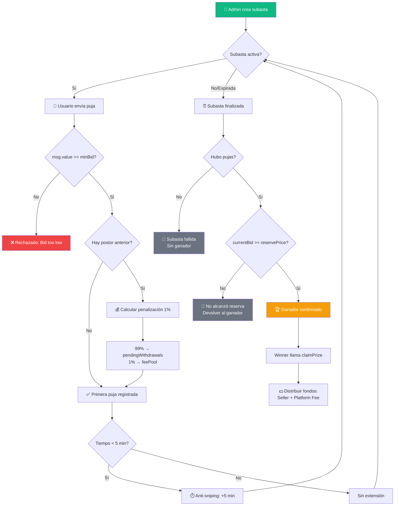
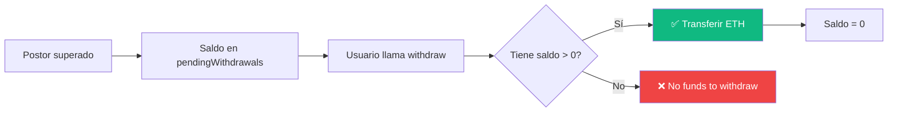
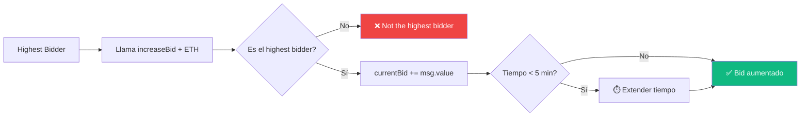

# 🔨 Flujo de Subasta - ZStore

## Diagrama de Flujo Principal



## Flujo de Retiro (Withdraw Pattern)



## Flujo de Incrementar Oferta



---

## 📋 Estados de la Subasta

| Estado | Descripción |
|--------|-------------|
| `Created` | Subasta creada, aún no iniciada |
| `Active` | Subasta en curso, acepta pujas |
| `Ended` | Tiempo terminado, pendiente de claim |
| `Claimed` | Ganador reclamó el premio |
| `Cancelled` | Cancelada antes de pujas |
| `Failed` | No alcanzó precio de reserva |

---

## 💰 Distribución de Fondos

```
┌─────────────────────────────────────────────────────────┐
│                    PUJA SUPERADA                        │
├─────────────────────────────────────────────────────────┤
│                                                         │
│   Monto original: 1 ETH                                 │
│                                                         │
│   ├── 99% (0.99 ETH) → pendingWithdrawals[bidder]      │
│   │                                                     │
│   └── 1%  (0.01 ETH) → feePool (retención)             │
│                                                         │
└─────────────────────────────────────────────────────────┘

┌─────────────────────────────────────────────────────────┐
│                  SUBASTA FINALIZADA                     │
├─────────────────────────────────────────────────────────┤
│                                                         │
│   Monto ganador: 10 ETH                                 │
│                                                         │
│   ├── 95% (9.5 ETH)  → Vendedor                        │
│   │                                                     │
│   └── 5%  (0.5 ETH)  → Platform Fee                    │
│                                                         │
│   + feePool acumulado → Admin puede retirar            │
│                                                         │
└─────────────────────────────────────────────────────────┘
```

---

## 🔐 Seguridad Implementada

| Mecanismo | Descripción |
|-----------|-------------|
| **ReentrancyGuard** | OpenZeppelin - Previene ataques de reentrancy |
| **Withdraw Pattern** | Usuario retira fondos, no envío automático |
| **Ownable** | Funciones admin restringidas al owner |
| **Validaciones** | Checks en cada función (estado, tiempo, montos) |
| **Anti-Sniping** | Extensión automática para evitar pujas de último segundo |

---

## 🎯 Funciones del Contrato

### Para Usuarios
```solidity
placeBid(auctionId)        // Realizar puja
increaseBid(auctionId)     // Aumentar puja existente (solo highest bidder)
withdraw()                 // Retirar fondos pendientes
placeDeposit(auctionId)    // Depositar garantía (si requerido)
refundDeposit(auctionId)   // Recuperar depósito
```

### Para Admin/Seller
```solidity
createAuction(...)         // Crear nueva subasta
startAuction(id, duration) // Iniciar subasta diferida
endAuction(auctionId)      // Finalizar subasta
cancelAuction(auctionId)   // Cancelar (solo sin pujas)
claimPrize(auctionId)      // Reclamar premio (winner)
withdrawFeePool()          // Retirar fees acumulados (admin)
```

### Configuración (Solo Owner)
```solidity
updatePlatformFee(%)       // Cambiar fee de plataforma
updateOutbidPenalty(%)     // Cambiar penalización (default 1%)
updateAntiSnipingParams()  // Configurar anti-sniping
updateMinBidIncrement(%)   // Cambiar incremento mínimo (default 5%)
```

---

## 📊 Ejemplo Práctico

**Subasta de Nike Air Max - Talle 42**

1. **Creación**: Admin crea subasta con precio base 0.5 ETH, reserva 1 ETH, duración 24h
2. **Puja 1**: Alice puja 0.6 ETH → `highestBidder = Alice`
3. **Puja 2**: Bob puja 1.0 ETH
   - Alice recibe: 0.6 × 0.99 = 0.594 ETH en `pendingWithdrawals`
   - feePool += 0.006 ETH
   - `highestBidder = Bob`
4. **Puja 3**: Charlie puja 1.2 ETH (en último minuto)
   - Bob recibe: 1.0 × 0.99 = 0.99 ETH
   - feePool += 0.01 ETH
   - ⏱️ Tiempo extendido +5 min (anti-sniping)
5. **Finalización**: Charlie gana
   - Seller recibe: 1.2 × 0.95 = 1.14 ETH
   - Platform recibe: 1.2 × 0.05 = 0.06 ETH
6. **Retiros**:
   - Alice llama `withdraw()` → recibe 0.594 ETH
   - Bob llama `withdraw()` → recibe 0.99 ETH
   - Admin llama `withdrawFeePool()` → recibe 0.016 ETH

---

*Documentación generada para ZStore - Sistema de Subastas Web3*
